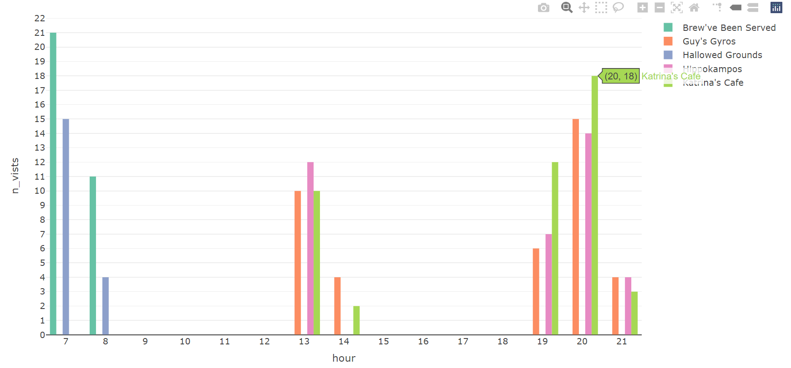

```{r setup, include=FALSE}
options(htmltools.dir.version = FALSE)
knitr::opts_chunk$set(fig.retina =3,
                      echo = TRUE,
                      eval = TRUE,
                      message = FALSE,
                      warning = FALSE)
```

**MOST POPULAR LOCATION**

The most popular location is identified using the credit card and the loyalty card dataset. A frequency bar chart has been ploted to visualize the same.

{width=100%}


The five most popular location in the span of two weeks are as follows:

S/N | Location | # vists_credit card | #vists_loyalty card
----|-----------|----------|---------
1. | Katrina's Cafe | 212 | 195
2. | Hippokampos | 171 | 155
3. | Guy's Gyros |158 | 146
4. | Brew've Been Served | 156 | 140
5. | Hallowed Grounds | 92 | 80

**Observation** - All the popular places are eatery.

**POPULAR TIME**

The below summarizes the time at which these locations were most popular:

S/N | Location | Most popular time
----|-----------|----------
1. | Katrina's Cafe | 8 pm
2. | Hippokampos | 8 pm
3. | Guy's Gyros |8 pm
4. | Brew've Been Served | 7 am
5. | Hallowed Grounds | 7 am

{width=100%}
{width=100%}

{width=100%}

{width=100%}

{width=100%}


**ANOMALY**

Prima-facie the following anomalies have been observed from the frequency bar chart:

1. There are couple of instances where the number of vists made to a location as per the credit card do not match with the loyalty card data. This indicates missing data in the two datasets.

2. There are 55 credit cards whereas the number of loyalty cards is 54. The credit card with no corresponding loyalty card will be identified in later part of the investigation.


